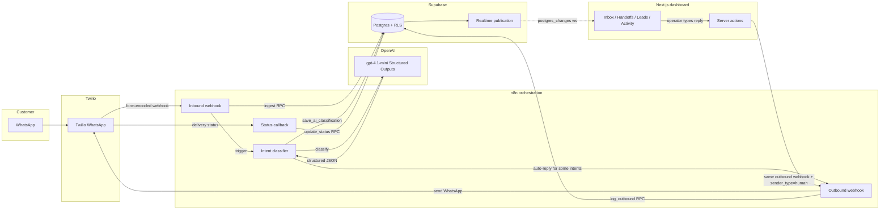

# WhatsApp AI Triage Engine

> A small-business WhatsApp inbox where every inbound message gets classified by
> an LLM, routed to the right queue, and surfaced to a human operator in real
> time — with the operator's typed reply going back through the same pipe as
> the AI's automatic replies.

[](https://nextjs.org/)
[](https://supabase.com/)
[](https://n8n.io/)
[](https://www.twilio.com/whatsapp)
[](LICENSE)

This repo is the result of a case study: how few moving parts does it take to
build a production-shaped WhatsApp triage system that handles real customer
load on a small business's main number? The answer turned out to be smaller
than expected.

---

## Quick start (demo mode, ~30 seconds)

```bash
git clone https://github.com/<your-fork>/whatsapp-ai-triage-engine.git
cd whatsapp-ai-triage-engine
docker compose up
```

Then open <http://localhost:3000>. The dashboard boots straight into a seeded
demo inbox with 18 fictional conversations, classifications, handoffs and
lead events — no Supabase, no n8n, no Twilio, no auth.

A built-in **realtime simulator** drips a new contextual inbound message into
a random open conversation every ~12 seconds, so the "Live" badge isn't
lying. You can:

- Click into any conversation, type a reply, watch the conversation move out
  of *Waiting on human*.
- Change status / priority on a conversation and watch the stats card update.
- Resolve handoffs from `/handoffs`.
- Mark lead events as in-progress / converted from `/leads`.

Everything is wired against an in-memory store that resets on container
restart — perfect for kicking the tires without setting anything up.

---

## What's in the box

```
.
├── apps/
│   └── dashboard-nextjs/       # Next.js 16 dashboard (App Router, RSC, Server Actions)
├── docs/                        # Architecture + operational notes
├── supabase/
│   └── functions/               # SQL: ingest_*, save_ai_classification, log_outbound, etc.
├── workflows/                   # n8n workflow JSON exports + import guide
├── Dockerfile                   # Multi-stage build → ~150MB runtime image
├── docker-compose.yml           # `docker compose up` boots the demo
├── .env.example                 # All env vars, documented
└── README.md
```

The dashboard is a single Next.js app. The n8n workflows + Supabase RPCs are
the orchestration layer. Everything else is documentation.

---

## Architecture



The key insight: **operator-typed replies and AI-generated replies go through
the same outbound webhook**, distinguished only by a `sender_type` field. That
means a single workflow handles delivery, logging, and status callbacks —
there's no second pipeline to maintain.

---

## The stack

| Layer | Choice | Why |
| --- | --- | --- |
| **Messaging** | Twilio WhatsApp | Best WhatsApp Business sandbox + cheap entry pricing for a case study |
| **Orchestration** | [n8n](https://n8n.io) (self-hosted) | Easy to import a workflow, no vendor lock-in, can be self-hosted next to the DB |
| **Data + Auth + Realtime** | Supabase (Postgres + Realtime + Auth) | One vendor for the persistence, RLS, and websocket fan-out cuts a huge amount of glue code |
| **LLM** | OpenAI `gpt-4.1-mini` with Structured Outputs | Strict JSON schema means classification is parse-error-free |
| **Dashboard** | Next.js 16 (App Router, RSC, Server Actions, Turbopack) | Server components keep the data layer on the server (no need for an extra API); server actions handle mutations without a REST scaffold |
| **UI** | Tailwind v4 + Radix Primitives + custom shell | Smallest set of dependencies that still gives full keyboard + accessibility behaviour |

---

## How realtime works

When an inbound message lands in Supabase, **every connected operator's
browser updates within ~300ms** with no polling. The chain is:

1. n8n upserts a row into `public.messages` (via service-role RPC).
2. Supabase's `supabase_realtime` publication broadcasts the `INSERT` over
   websocket.
3. The dashboard subscribes to `postgres_changes` for the 5 triage tables
   (`conversations`, `messages`, `ai_classifications`, `handoff_requests`,
   `lead_events`) on a single multiplexed channel.
4. A 300ms debounce coalesces bursts (a single inbound webhook can write a
   message → classification → lead event in quick succession).
5. The client calls `router.refresh()`, Next.js re-renders the relevant server
   components, the user sees fresh data.

**Gotcha worth knowing**: with `@supabase/ssr` the auth session lives in
cookies, but the realtime websocket needs the JWT propagated explicitly via
`supabase.realtime.setAuth(token)` — otherwise the channel subscribes as
`anon`, RLS silently filters every event, and you get a "Live" badge with
zero events. See `src/components/realtime/realtime-refresher.tsx`.

---

## Security model

The hard line: **operators can only see triage data after they've been
explicitly allowlisted**. No "anyone with a magic link is in" shortcuts.

- A `triage_operators` table holds the allowlist (id, user_id, email, role,
  active). An `is_triage_operator()` `SECURITY DEFINER` helper resolves to a
  boolean against the caller's `auth.uid()`.
- All 6 triage tables (`contacts`, `conversations`, `messages`,
  `ai_classifications`, `handoff_requests`, `lead_events`) have RLS policies
  of the form `using (public.is_triage_operator())` — no wide-open
  `using (true)`.
- A trigger on `auth.users` links a freshly-signed-up user back to their
  allowlist row by email (case-insensitive), so the operator onboarding flow
  is "add the email to `triage_operators`, then send them a magic link".
- Server actions call `requireOperator()` **before** the service-role write.
  RLS is the second line of defence, not the only one.
- The service-role key is server-only — no client component ever imports it.

---

## Demo mode internals

`DEMO_MODE=true` short-circuits 11 surfaces:

| Surface | Behaviour |
| --- | --- |
| All 6 `lib/data/*` fetchers | Return data from `lib/demo/store.ts` (an in-memory singleton seeded from `lib/demo/fixtures.ts`) |
| `requireOperator()` | Returns a fake admin operator without hitting Supabase |
| `(app)/layout.tsx` | Skips the auth + allowlist check, renders the shell directly |
| `proxy.ts` | Redirects `/` and `/login` → `/inbox`; doesn't refresh sessions |
| All 4 server actions | Mutate the in-memory store instead of calling Supabase / n8n |
| `RealtimeRefresher` | Polls `/api/demo/tick` every 12s instead of subscribing to Supabase Realtime |
| `/api/demo/tick` | Picks a random open conversation, appends a contextually-appropriate new inbound message + AI classification |
| `next-with-root-env.mjs` | Suppresses the missing-Supabase-key warning |

The fixtures cover the full intent surface (sales lead, reservation,
support, human escalation, spam, unknown) and the simulator picks
follow-ups consistent with the existing conversation intent, so the demo
feels coherent rather than random noise.

---

## Real-mode setup

> Total setup time on a fresh laptop: ~30 minutes. Most of that is waiting on
> Supabase + n8n boot.

### 1. Supabase

1. Create a new Supabase project at <https://supabase.com>.
2. Open the SQL editor and run the migration SQL (the triage tables,
   indexes, `triage_operators` allowlist, `is_triage_operator()` helper, and
   RLS policies). The exact migrations referenced in `docs/` aren't shipped
   in this repo as standalone files yet — they're recoverable from the schema
   under `supabase/functions/` plus the data-types reference in
   `apps/dashboard-nextjs/src/lib/data/types.ts`. *(Contributions welcome to
   ship a canonical `supabase/migrations/` set.)*
3. **Enable Realtime** on the 5 triage tables:
   `conversations`, `messages`, `ai_classifications`, `handoff_requests`,
   `lead_events` — add them to the `supabase_realtime` publication.
4. Configure SMTP in **Project Settings → Authentication → SMTP** so magic
   links arrive instead of getting Supabase-throttled. Any decent SMTP relay
   (Zoho, Postmark, SES, Resend) works.
5. Seed your operator email into `triage_operators`:
   ```sql
   insert into triage_operators (email, role, active)
   values ('you@example.com', 'admin', true);
   ```

### 2. n8n

1. Spin up n8n (the cloud SaaS is fine, or self-host with Docker).
2. Import the 4 JSON workflows from `workflows/` (see `workflows/README.md`
   for the credential checklist).
3. Activate all four; copy the production webhook URLs.

### 3. Twilio

1. Set up a [WhatsApp sender](https://www.twilio.com/docs/whatsapp/sandbox)
   or activate a production sender on your Account.
2. Set the sender's **inbound webhook** to your `n8n-twilio-incoming-webhook`
   URL.
3. Set the **status callback** to your `n8n-twilio-message-status-webhook`
   URL.

### 4. Dashboard

```bash
cp .env.example .env
# Set DEMO_MODE=false and fill in:
#   SUPABASE_URL, SUPABASE_SERVICE_ROLE_KEY,
#   NEXT_PUBLIC_SUPABASE_URL, NEXT_PUBLIC_SUPABASE_ANON_KEY,
#   N8N_OUTBOUND_WEBHOOK_URL,
#   TWILIO_WHATSAPP_FROM
docker compose up --build
```

Open <http://localhost:3000>, sign in with your operator email, click the
magic link in your inbox, and you should land on `/inbox` with whatever
data is in your Supabase.

---

## Webhook contracts

If you don't want to use the shipped n8n workflows, here are the contracts
the dashboard expects so you can wire up your own orchestrator.

### Inbound (Twilio → your orchestrator → Supabase RPC)

Your orchestrator receives Twilio's standard form-encoded WhatsApp webhook
(`From`, `To`, `Body`, `MessageSid`, etc.) and must call:

```http
POST {SUPABASE_URL}/rest/v1/rpc/ingest_twilio_whatsapp_message
Authorization: Bearer {SUPABASE_SERVICE_ROLE_KEY}
apikey: {SUPABASE_SERVICE_ROLE_KEY}
Content-Type: application/json

{
  "twilio_message_sid": "SM...",
  "from": "whatsapp:+15550000001",
  "to":   "whatsapp:+15550100000",
  "body": "Hi, table for 4 this Saturday?",
  "profile_name": "Marcus Rivera"
}
```

The RPC handles contact upsert, conversation upsert (keyed by
`external_thread_id`), and message insert with idempotency on `twilio_message_sid`.

### Outbound (dashboard / orchestrator → Twilio → log)

The dashboard's `sendOperatorReply` action POSTs to `N8N_OUTBOUND_WEBHOOK_URL`:

```json
{
  "source": "operator_dashboard",
  "sender_type": "human",
  "conversation_id": "<uuid>",
  "operator_email": "you@example.com",
  "to":   "whatsapp:+15550000001",
  "from": "whatsapp:+15550100000",
  "body": "Yes — confirmed for 4 at 8pm on Saturday."
}
```

Your orchestrator should: send via Twilio, then log via Supabase RPC:

```http
POST {SUPABASE_URL}/rest/v1/rpc/log_twilio_whatsapp_outbound_message
{
  "twilio_message_sid": "SM...",
  "from": "whatsapp:+15550100000",
  "to":   "whatsapp:+15550000001",
  "body": "...",
  "sender_type": "human",
  "delivery_status": "queued"
}
```

### Classification (orchestrator → OpenAI → Supabase RPC)

Pull conversation context via:

```http
POST {SUPABASE_URL}/rest/v1/rpc/get_whatsapp_classification_context
{ "message_id": "<uuid>", "recent_limit": 8 }
```

Send to OpenAI with [Structured Outputs](https://platform.openai.com/docs/guides/structured-outputs)
matching the schema in `supabase/functions/ai_intent_classification.sql`.
Save the result via:

```http
POST {SUPABASE_URL}/rest/v1/rpc/save_ai_classification
{
  "message_id": "<uuid>",
  "intent": "sales_lead",
  "confidence": 0.92,
  "urgency": "medium",
  "summary": "Wants pricing for 30-person offsite.",
  "recommended_action": "Send Garden Room package + menu",
  "model": "gpt-4.1-mini"
}
```

---

## Intent taxonomy

| Intent | What it means | Typical UI consequence |
| --- | --- | --- |
| `sales_lead` | Net-new revenue opportunity | Creates a `lead_events` row, bumps `contacts.lead_score` |
| `reservation_booking` | Reservation / appointment request | Routed to the reservations queue; conversation stays "open" |
| `support_faq` | Question with a public answer | AI replies inline if confident; otherwise escalates |
| `human_escalation` | Customer wants a human OR AI is out of depth | Creates a `handoff_requests` row, surfaces in `/handoffs` |
| `spam_noise` | Promotional spam, scam, or noise | Conversation auto-closed, no reply sent |
| `unknown` | Too ambiguous to classify | AI sends a clarifying question |

The full taxonomy is encoded in the structured-output JSON schema —
adding a new intent is a one-line change there + a one-line change in
`apps/dashboard-nextjs/src/app/(app)/actions/schemas.ts`.

---

## File map for the dashboard

```
apps/dashboard-nextjs/src/
├── app/
│   ├── (app)/                          # Route group — everything behind auth
│   │   ├── layout.tsx                  # Auth + operator-allowlist check (skipped in DEMO_MODE)
│   │   ├── inbox/                      # Inbox list + conversation detail
│   │   ├── handoffs/, leads/, activity/
│   │   └── actions/                    # Server actions (reply, status, priority, handoff, lead)
│   ├── api/demo/tick/                  # Demo realtime simulator endpoint
│   ├── auth/callback/                  # Magic-link exchange
│   ├── login/, logout/
│   └── proxy.ts                        # Session refresh + public-path allowlist (Next 16 proxy)
├── components/
│   ├── app-shell/                      # Sidebar, topbar, sheet menu
│   ├── dashboard/                      # Inbox list, conversation detail, classification panel, work queue
│   ├── realtime/                       # RealtimeRefresher + status context
│   └── ui/                             # Button, Card, Input, Sheet, etc. (Tailwind + Radix)
├── lib/
│   ├── auth/require-operator.ts        # Gate for server actions
│   ├── data/                           # Per-page composable fetchers (Supabase-backed)
│   ├── demo/                           # mode, fixtures, store, simulator (DEMO_MODE only)
│   └── supabase/                       # admin (service-role) + server (RLS-bound) + browser clients
```

---

## Trade-offs worth knowing

- **Single n8n outbound webhook**. Operator replies and AI replies share one
  endpoint, distinguished by `sender_type`. Simpler to operate; also means a
  bug in one path can drop the other. We accepted that.
- **In-memory demo store is per-process**. If you run the demo behind a
  load balancer with multiple instances, the simulator state will diverge per
  pod. Fine for a single docker container; if you need multi-instance demo
  you'd want Redis.
- **Realtime relies on RLS**. Operators only see events for the rows their
  RLS lets them read. That's a feature, not a bug — but it means
  misconfigured RLS == silently broken realtime.
- **AI replies are conservative by design**. The shipped n8n workflow only
  acknowledges + asks for missing info; it never invents prices or dates.
  Trade speed of response for not-making-things-up.

---

## Roadmap

Things that are obvious next steps if you take this further:

- **Drafted AI replies the operator can edit-and-send**, instead of either
  auto-send or full-manual.
- **Per-action audit log** (who set this conversation to high priority?).
- **Search** — the topbar input is decorative; wiring fuzzy search across
  contacts + messages would unblock the next scale tier.
- **Handoff assignment** (who's handling this?).
- **Canonical `supabase/migrations/`** — currently the schema lives only in
  the live Supabase project's migration history. A clean migration set
  would make `git clone && supabase db reset` work out of the box.

---

## Contributing

PRs welcome, especially for:
- The canonical supabase migrations set noted above.
- Additional intent classes / additional demo fixtures.
- A self-hosted n8n compose profile.
- Localized demo fixtures (Spanish/Portuguese/French) so the case study
  reads more globally.

Please run `npx next build` before opening a PR to make sure TypeScript is
clean.

---

## License

[MIT](LICENSE).

The fictional business name **"Northcrest Café & Events"** used in the demo
fixtures, the persona names (Sarah Chen, Marcus Rivera, etc.), and the
+1 555 phone numbers are all invented — no resemblance to anyone real.
